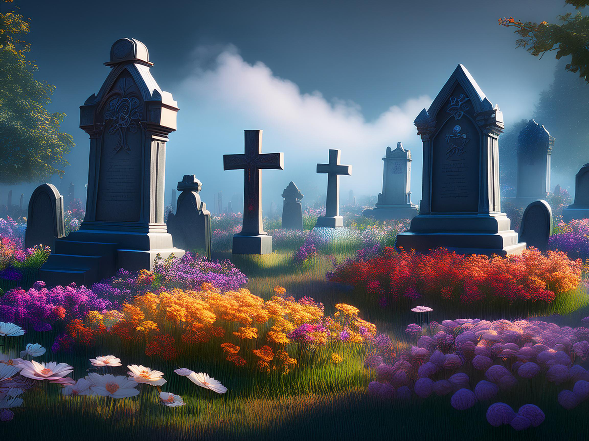
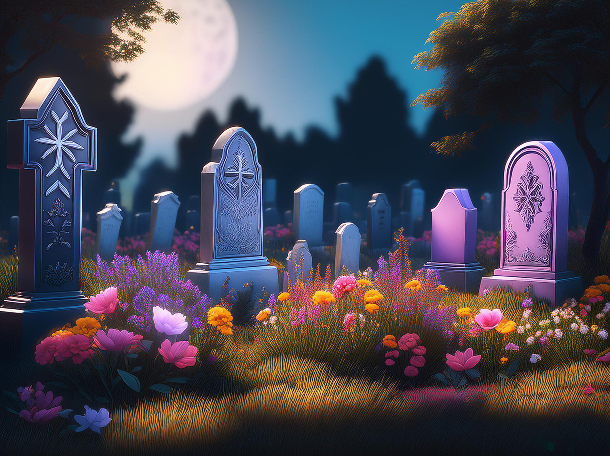

# Alive GROW #
___
***Project Breakdown:*** The "Alive Grow" is a game where you play as a ghost who takes care of a graveyard. The player's goal is to restore a graveyard and protect the flowers, in a time gap. The main game mechanics are to water plants, cut the bushes, and deficit the slugs and other creatures. The player has a time limit, and it also can only care for one tool at a time. 
***Game Settings:*** The dark spooky graveyard, is not too big. The player is in a closed setting. *Some picture examples generated in a adobe photoshop.* 
 
***Game Mechanics:*** in progress...

___
# Development Journal  #
### Movement and gardening tools ###
Since the game is about the ghost. I had to modify the original game First Person Controller, by modifying the gravity I was able to achieve the floating of the character. I also didn't want the character to jump so I modified the jumping force to make sure the player doesn't jump and if they do it won't be high. After testing I was able to achieve the ghost-floating movement. The next step for me would be to develop the gardening tools mechanics and add the Niagara particles system to add the feel of a ghost flying. I was looking for the assets on Sketchfab since they are free and already have textures. There are three assets that I got from there. They are also declared in the "Declared assets" folder. 

My approach to gardening tools is 

# TO DO: #

- [x] GHOUST movement
- [x] Item Pick Up
- [ ] Shovel
- [ ] Watering Can
- [ ] Plant progression
- [ ] Slugs enemy?
- [ ] Point system
- [ ] Timer?

# Declered assets #

